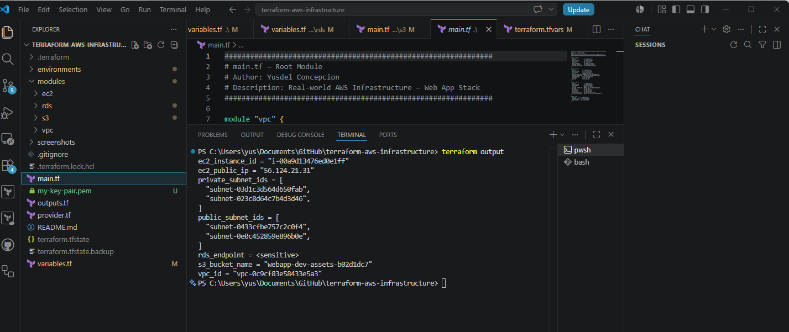
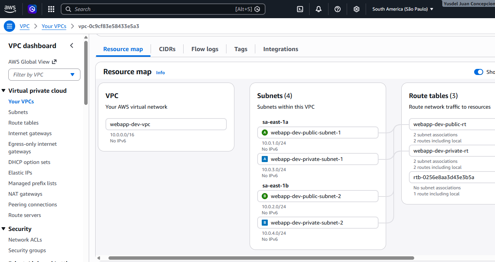
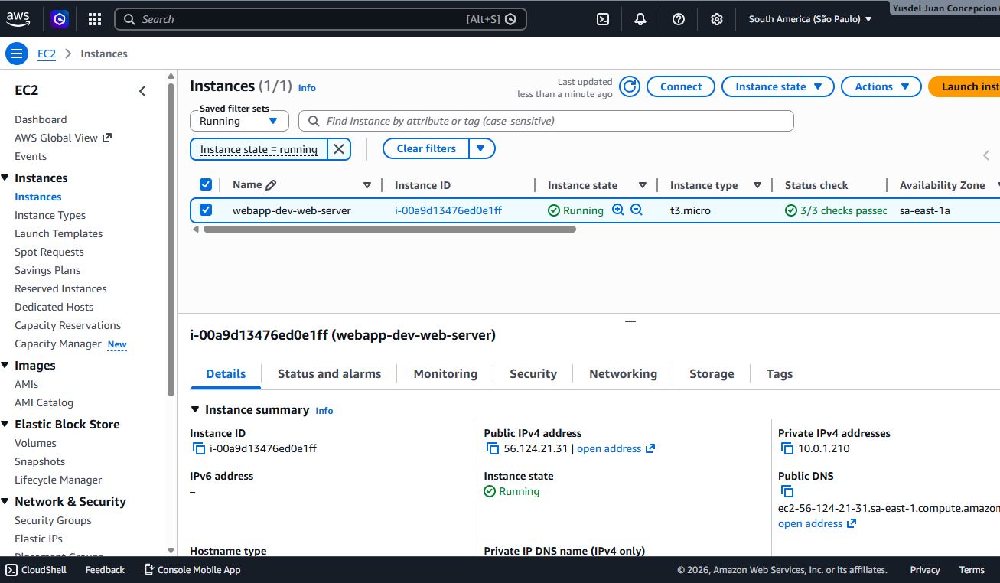
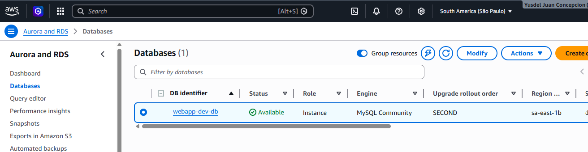
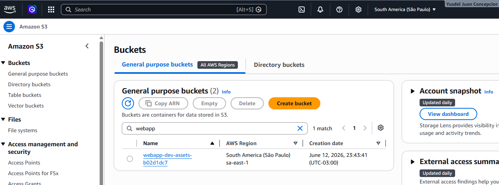
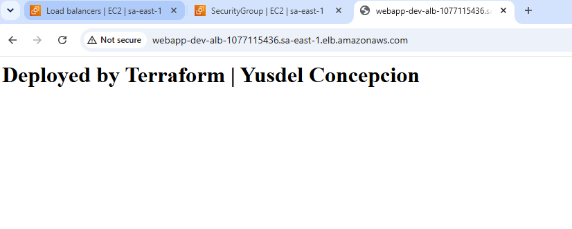
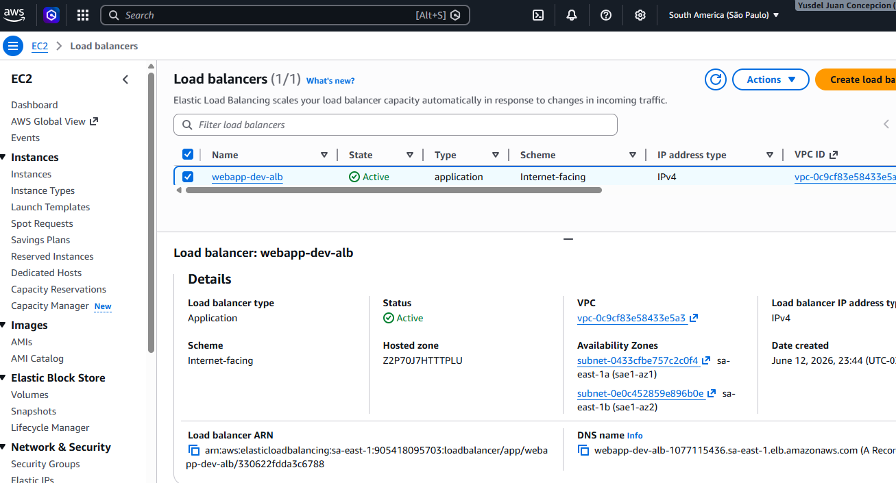

# Terraform AWS Infrastructure — Web Application Stack


## 📋 Overview

Production-ready AWS infrastructure for a web application stack, built with
Terraform using a modular approach. Designed for scalability, security, and
multi-environment support (dev/prod).

## 🏗️ Architecture

```
Internet
    │
    ▼
[ALB - Application Load Balancer]  ← Public Subnets
    │
    ▼
[EC2 Web Server]                   ← Public Subnets
    │
    ▼
[RDS MySQL Database]               ← Private Subnets
    │
[S3 Assets Bucket]                 ← Encrypted + Versioned
```

## 📦 Modules

| Module | Resources Created |
|--------|------------------|
| `vpc` | VPC, Public/Private Subnets, IGW, NAT Gateway, Route Tables |
| `ec2` | EC2 Instance, ALB, Security Groups, Target Groups |
| `rds` | RDS MySQL, DB Subnet Group, Security Group |
| `s3`  | Private S3 Bucket, Versioning, Encryption, Lifecycle Policy |

## 🛠️ Technologies

- Terraform >= 1.0
- AWS Provider ~> 5.0
- AWS Services: VPC, EC2, ALB, RDS MySQL 8.0, S3

## 🚀 Usage

### Prerequisites
- AWS account with appropriate permissions
- Terraform installed (>= 1.0)
- AWS CLI configured (`aws configure`)

### Deploy Dev Environment

```bash
# Clone the repository
git clone https://github.com/juanyusdel-coder/terraform-aws-infrastructure
cd terraform-aws-infrastructure

# Initialize Terraform
terraform init

# Preview changes
terraform plan -var-file="environments/dev/terraform.tfvars"

# Apply infrastructure
terraform apply -var-file="environments/dev/terraform.tfvars"
```

### Deploy Prod Environment

```bash
terraform apply -var-file="environments/prod/terraform.tfvars"
```

### Destroy Infrastructure

```bash
terraform destroy -var-file="environments/dev/terraform.tfvars"
```

## 📁 Project Structure

```
terraform-aws-infrastructure/
├── main.tf                    # Root module — calls all modules
├── variables.tf               # Root input variables
├── outputs.tf                 # Root outputs
├── provider.tf                # AWS provider & backend config
├── .gitignore
├── modules/
│   ├── vpc/
│   │   ├── main.tf            # VPC, Subnets, IGW, NAT, Route Tables
│   │   ├── variables.tf
│   │   └── outputs.tf
│   ├── ec2/
│   │   ├── main.tf            # EC2, ALB, Security Groups
│   │   ├── variables.tf
│   │   └── outputs.tf
│   ├── rds/
│   │   ├── main.tf            # RDS MySQL, DB Subnet Group
│   │   ├── variables.tf
│   │   └── outputs.tf
│   └── s3/
│       ├── main.tf            # S3 Bucket, Versioning, Encryption
│       ├── variables.tf
│       └── outputs.tf
└── environments/
    ├── dev/terraform.tfvars   # Dev environment variables
    └── prod/terraform.tfvars  # Prod environment variables
```

## 🔒 Security Features

- ✅ Private subnets for database layer
- ✅ Security groups following least privilege
- ✅ RDS accessible only from EC2 security group
- ✅ S3 bucket with public access blocked
- ✅ S3 server-side encryption (AES256)
- ✅ EBS volumes encrypted
- ✅ RDS storage encrypted
- ✅ NAT Gateway for private subnet outbound traffic

## 📊 Outputs

After `terraform apply`, the following outputs are available:

```bash
terraform output vpc_id
terraform output ec2_public_ip
terraform output s3_bucket_name
terraform output rds_endpoint   # sensitive
```
## 📸 Deployment Evidence

### Terraform Apply


### AWS Console — VPC


### AWS Console — EC2


### AWS Console — RDS


### AWS Console — S3


### Web App Live

### AWS Console — Load Balancer


## 💡 Production Recommendations

- Use **AWS Secrets Manager** for database credentials
- Enable **S3 backend** for remote state (see `provider.tf`)
- Set `deletion_protection = true` on RDS
- Set `skip_final_snapshot = false` on RDS
- Restrict SSH ingress to specific IP addresses

## 👤 Author

**Yusdel Concepcion** — Senior DevOps & Cloud Engineer

- 🌐 LinkedIn: [linkedin.com/in/yusdelconcepcion](https://linkedin.com/in/yusdelconcepcion)
- 💻 GitHub: [github.com/juanyusdel-coder](https://github.com/juanyusdel-coder)
- 📧 juanyusdel@gmail.com

## 📄 License

MIT License — feel free to use and adapt.
